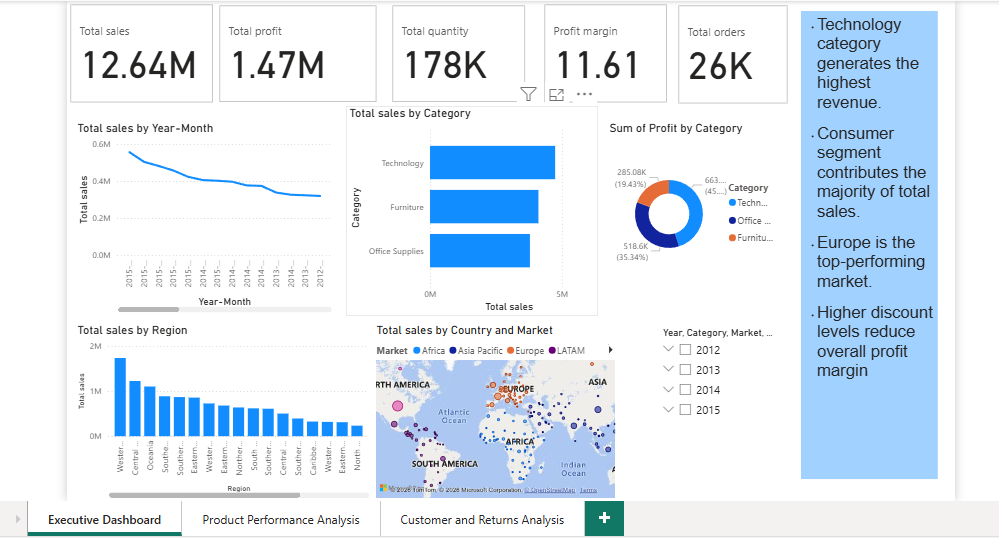
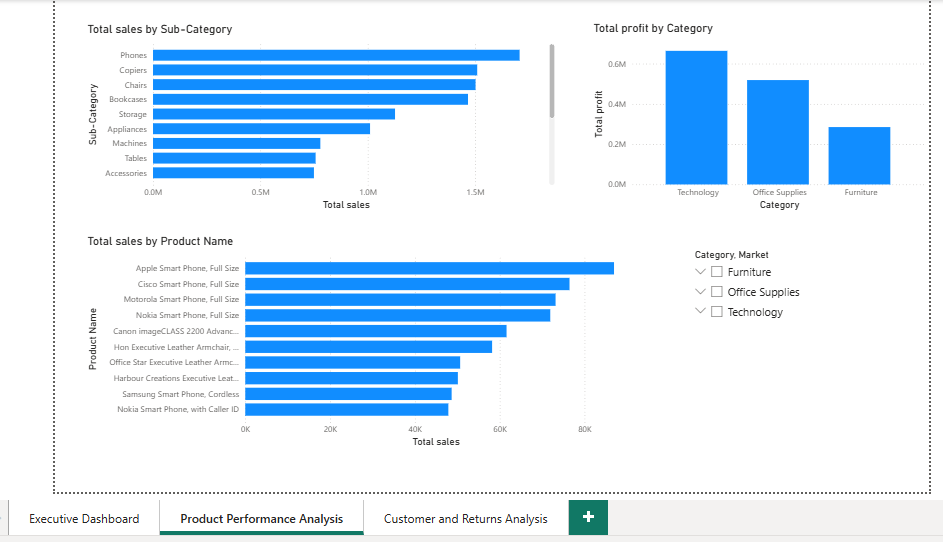
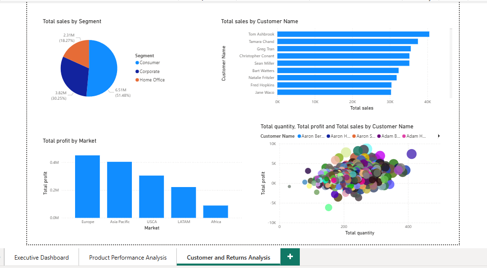

# E-commerce Sales Analysis Dashboard

## 📊 Project Overview
This project analyzes E-commerce sales data using SQL and Power BI to identify revenue trends, profit performance, and customer behavior.

## 🛠 Tools Used
- SQL
- Power BI

## 📈 Key Insights
- Technology category generated highest sales.
- Europe region contributed major revenue.
- Higher discounts reduced profit margins.
- Consumer segment had the most orders.

## 📷 Dashboard Preview

### Page 1

### Page 2

### Page 3

---

⭐ This project demonstrates practical skills in data analysis, SQL querying, and dashboard creation.
